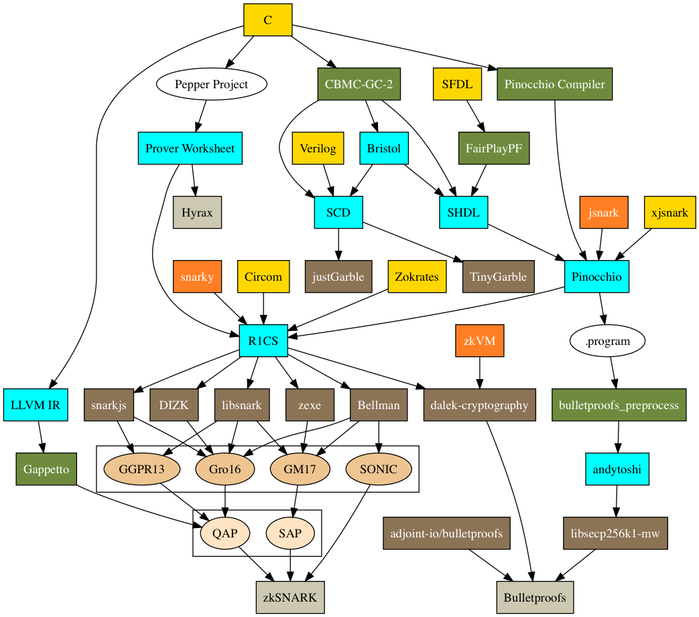

# High-Level languages for zkSNARKs, Fully-Homomorphic-Encryption and Multi-Party-Computation

# zkSNARKs

## High-Level Languages for zkSNARKs

 * https://github.com/arnaucube/go-snark
 * https://github.com/republicprotocol/zksnark-rs
 * https://github.com/o1-labs/snarky
 * Pinocchio & Gappetto - https://github.com/corda/msr-vc
 * Jsnark - https://github.com/akosba/jsnark
 * xjsnark - https://github.com/akosba/xjsnark
 * Pepper Project - https://github.com/pepper-project/
 * Circom - https://github.com/iden3/circom
 * ZoKrates - https://github.com/Zokrates/ZoKrates
